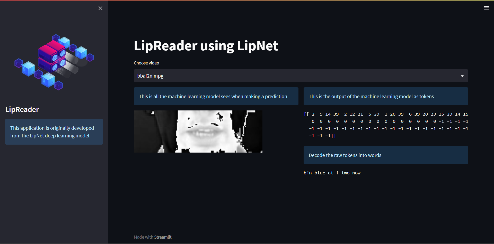

LipReader using LipNet
LipReader is a web application developed using the LipNet deep learning model for lip reading. It predicts the spoken words by analyzing lip movements in a video.

Overview
The LipReader application allows users to select a video and visualize the lip movements detected by the machine learning model. It then generates a prediction of the spoken words based on the lip movements.

LipReader Demo

Features
Select a video: Choose from a list of available videos for lip reading analysis.
Visualize lip movements: The application displays the video with annotated lip regions to show what the machine learning model sees during prediction.
Generate predictions: The model predicts the spoken words based on the lip movements and displays the results as tokens and converted text.
# LipReader

LipReader is a web application developed using the LipNet deep learning model for lip reading. It predicts the spoken words by analyzing lip movements in a video.



## Table of Contents

- [Description](#description)
- [Installation](#installation)
- [Usage](#usage)
- [Contributing](#contributing)
- [License](#license)

## Description

LipReader is an application that utilizes deep learning to perform lip reading. It takes a video as input and predicts the corresponding text based on the movements of the lips in the video. This application is built on the LipNet model, which is a deep learning architecture designed for lip reading tasks.

## Installation

To use LipReader, follow these steps:

1. Clone the repository:
```shell
git clone https://github.com/your-username/lipreader.git
```

2. Install the dependencies:
```shell
pip install -r requirements.txt
```

3. Navigate inside the app folder
```shell
cd app
```

4. Run the streamlit app
```shell
python streamlitapp.py
```

## Usage
1. Open the LipReader application.

2. Select a video from the provided options.

3. The application will display the video and the output of the lip reading model.

4. The predicted text will be shown in the application's interface.

## Contributing
Contributions to LipReader are welcome! If you encounter any issues or have suggestions for improvements, please create a new issue or submit a pull request.